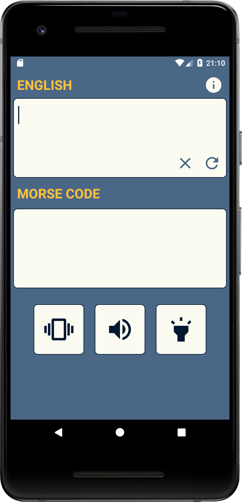
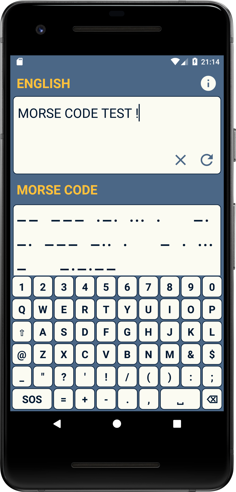
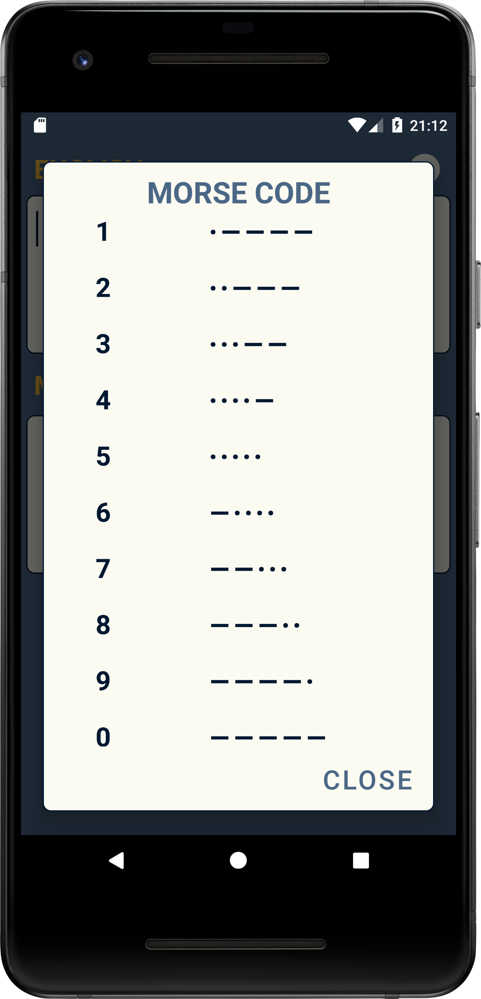

# MorseCodeConverter
MorseCodeConverter created in Android Studio

Custom keyboard is to input text into EditText field.

Press Fefresh button to convert text into Morse Code symbols.

Press Vibration, Tone or Flash buttons to play sound.

  
